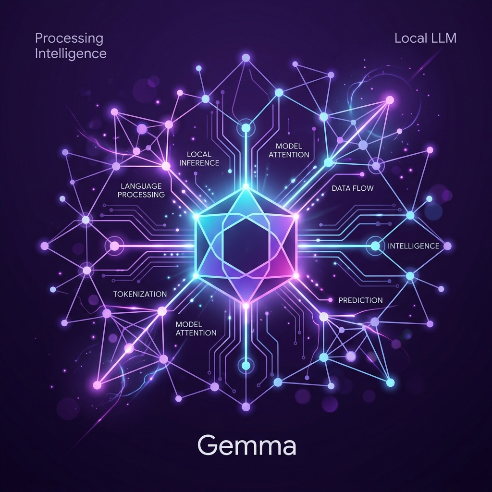

# Gemma Flask Chat Console

A lightweight, local web interface for interacting with Google's Gemma models via `llama.cpp`. Built using Flask, vanilla JavaScript, and CSS.



## Features

- **Local Inference Client:** Connects to a local `llama-server` instance.
- **Markdown & Code Highlighting:** Automatically renders markdown and highlights code blocks with copy options.
- **Shortcut Controls:** Send messages by pressing `Enter` and wrap text/add newlines with `Shift+Enter`.
- **System Telemetry:** Real-time checking of local Llama service connection state and runtime uptime badges.
- **Customizable Prompts:** Easily modify the model's system prompt and temperature parameters directly from the interface.
- **Responsive Dark Theme:** Sleek design with glassmorphic cards and dynamic accent hue shifting.

## Setup & Running

### 1. Requirements
Ensure you have Python 3 and a virtual environment set up. Flask dependencies should be installed:
```bash
python3 -m venv venv
source venv/bin/activate
pip install flask
```

### 2. Launching Llama Server
Compile and start your local Llama server on port `8080` (replacing the model path with your `.gguf` file):
```bash
./llama.cpp/build/bin/llama-server -m ./gemma-4-E4B-it-Q8_0.gguf -t 8 -ngl 99 -c 4096 -fa on --port 8080
```

### 3. Launching Flask Application
In a separate terminal, run the Flask entry point:
```bash
python main.py
```
Open `http://127.0.0.1:5000` in your web browser to start chatting.
